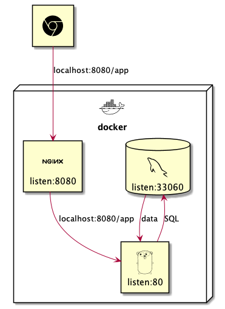
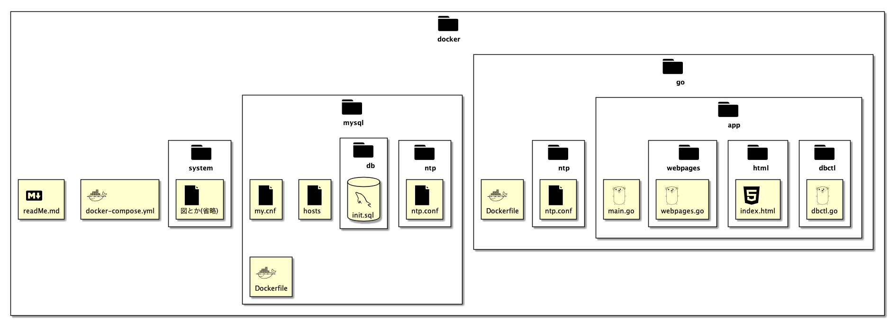

# Docker の使い方(Mac,Linux 向け)

## 手順 1

`cd koukaten2020/production/docker`で`docker`ディレクトリに入る

## 手順 2

`docer network create production_network`する

## 手順 3

`docker-compose build`する
**ファイルに変更を加えた場合、これを実行することで docker の環境に変更が反映される**

## 手順 4

`docker-compose up`する
**初回起動時のみ、go 言語のサーバーが起動してから MySQL の初期化が終わるまでしばらく待つ必要がある**

## システム構成図

## ファイル構成図

`docker/go/app/`,`mysql/db/`の中は書き換えていいよ
`docker-compose.yml`,`Dockerfile`は触らないでね
